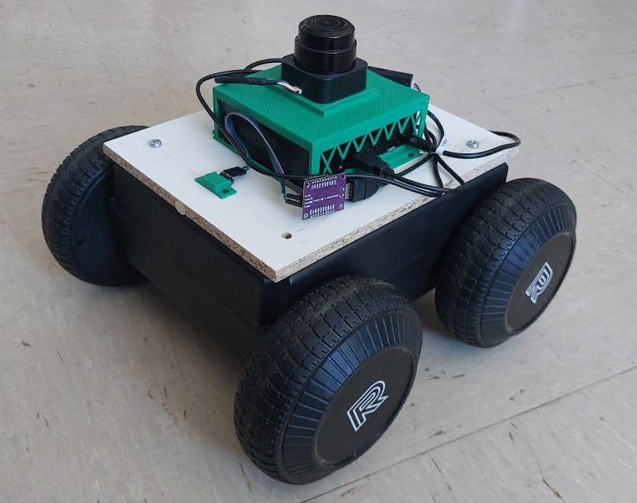

# Tesi: An Implementation of Open-RMF

Use nav2 and Open-rmf with this rover:

the sequence can be found in 000_sequencelaunch, some path are set using the test machine:
- 000_mini is used on real robot
- 000_mini_simul is for the simulation

More info on the planner used: 
[DStar-Trajectory-Planner](https://github.com/ElettraSciComp/DStar-Trajectory-Planner/tree/ros2_port)

then for Open-RMF follow sequnce on:
- 001_rmf

## Simulation

It's suggested to download the code from this site and then share in the docker with -v, more info on the code before.